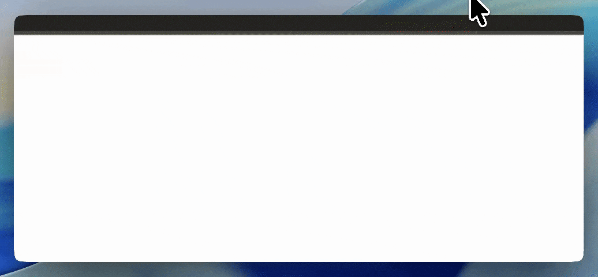
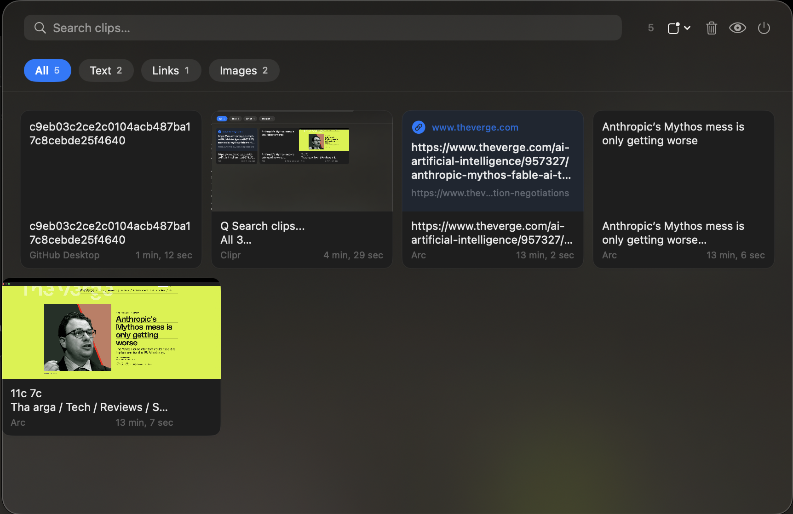

# Clipr

A local-first, visual clipboard history manager for macOS — lives in your menu bar.

  

## Features

- **Visual grid** — every clip shown as a card: screenshots, colors, code, URLs, files, rich text
- **Click to paste** — click any card to instantly paste it into whatever app you were using
- **Multi-select** — Cmd+click to select multiple clips and paste them all at once
- **Instant search** — full-text across content, OCR text, and URL titles
- **Type filters** — filter by Text, Image, URL, Color, Code, File
- **Duplicate detection** — identical clips collapse into one card with a copy count badge
- **Pin clips** — keep important clips at the top permanently
- **Incognito mode** — pause capture with one click
- **On-device OCR** — Apple Vision extracts text from screenshots automatically
- **Quick Paste** — global `Cmd+Shift+V` overlay to paste without leaving your keyboard
- **Sensitive data filtering** — skips password managers, credit cards, API keys automatically
- **Launch at Login** — right-click the menu bar icon to enable

## How it works

1. Copy anything — Clipr captures it silently in the background
2. Click the menu bar icon (or press `Cmd+Shift+V`) to open the panel
3. Click a clip to paste it directly into your last active app
4. Cmd+click to select multiple clips, then hit **Paste N** to paste them all joined together

## Privacy

- No cloud sync, no analytics, no telemetry
- All data stored locally in `~/Library/Application Support/Clipr/`
- OCR runs entirely on-device via Apple Vision

## Tech

- Swift + SwiftUI (macOS 13+)
- [GRDB](https://github.com/groue/GRDB.swift) for local SQLite storage
- Custom `NSWindow` notch panel with spring animation
- `CGEventTap` for global hotkey and paste simulation (requires Accessibility permission)
- `AVAudioEngine` for programmatic UI sounds
- `CryptoKit` SHA-256 for duplicate detection

## First launch

Clipr will prompt for **Accessibility** permission on first launch — this is required to simulate Cmd+V when pasting into other apps. Grant it in System Settings → Privacy & Security → Accessibility.

## Building

1. Open `Clipr.xcodeproj` in Xcode 15+
2. Set your development team in project settings
3. Build & run (`Cmd+R`)

> Distributed as a DMG — not available on the Mac App Store (CGEventTap requires full Accessibility access).

## License

MIT
