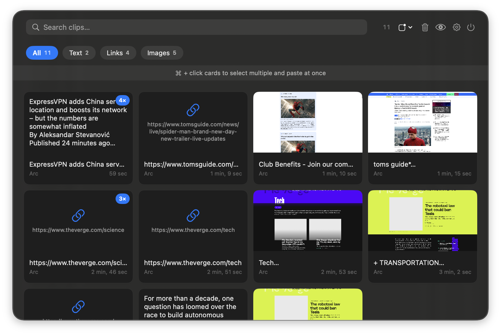
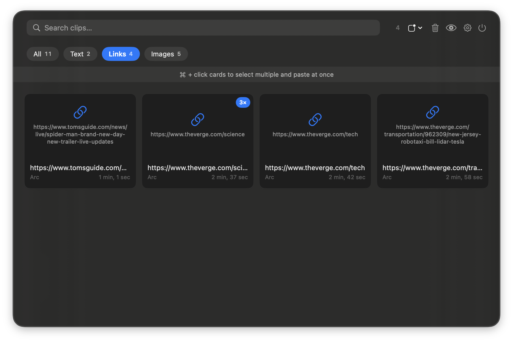
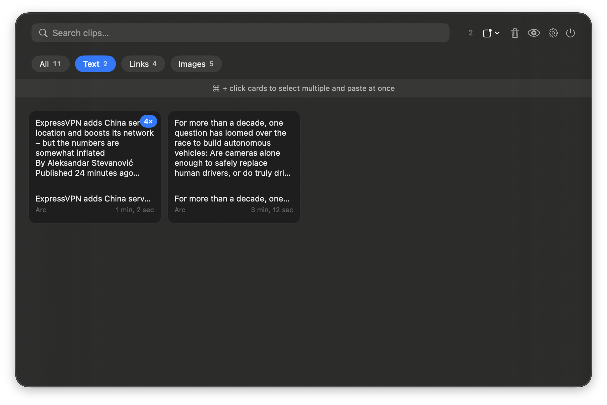
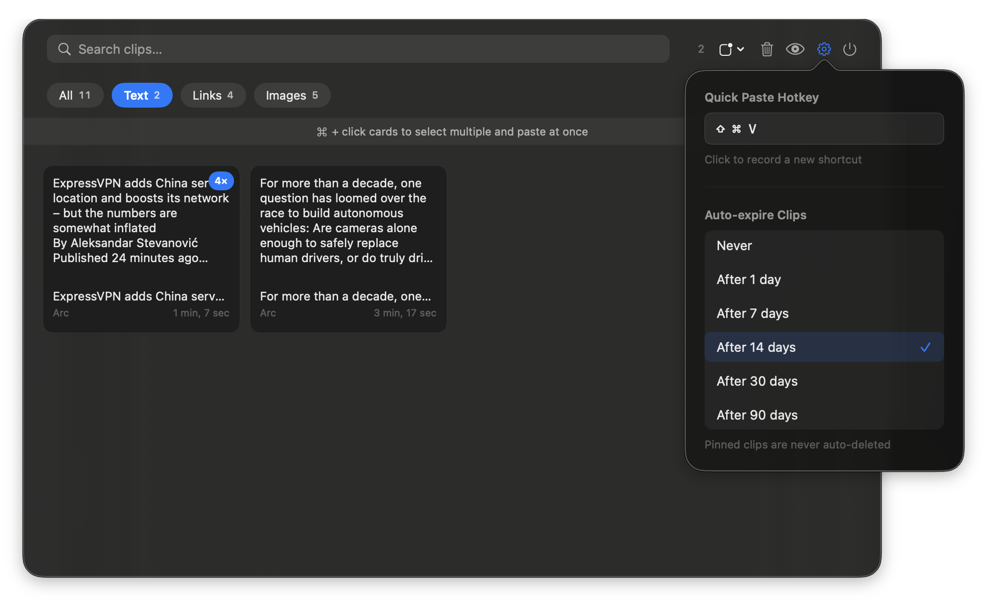

# Clipr

A local-first, visual clipboard history manager for macOS — lives in your menu bar and stays out of the way.

[](https://github.com/Gikunjuu/clipr/releases/tag/v1.1)









## Download

Download **[Clipr-v1.1.dmg](https://github.com/Gikunjuu/clipr/releases/tag/v1.1)**, open it, and drag Clipr to your Applications folder.

> On first launch, macOS may say the app is from an unidentified developer. Go to System Settings → Privacy & Security and click **Open Anyway**.
>
> Clipr will also prompt for **Accessibility** permission — required to paste clips into other apps.

## What's new in v1.1

- Hotkey customization — set your own shortcut instead of the default `⇧ ⌘ V`
- Clip editing — double-click any text card to edit it before pasting
- Auto-expire — automatically delete clips older than 1, 7, 14, 30, or 90 days (pinned clips are exempt)
- Settings panel accessible from the gear icon in the panel header

## Features

- Visual clipboard history in a Dynamic Island–style notch panel
- Click any clip to instantly paste it into your last active app
- Cmd+click to select multiple clips and paste them all at once
- Duplicate detection — identical clips collapse into one card with a copy count
- On-device OCR extracts text from screenshots (Apple Vision)
- Incognito mode — pause capture for passwords and sensitive data
- Pin clips to keep them at the top
- Filter by content type or source app
- Full-text search across all clips including OCR text
- Global hotkey (default `⇧ ⌘ V`) to open the quick paste overlay
- Sensitive data filtering — skips password managers, API keys, credit cards
- Launch at Login support
- No cloud sync, no analytics, all data stays on your Mac

## How it works

Clipr watches the system clipboard using `NSPasteboard` change-count polling and stores everything locally in SQLite (via GRDB) and a flat file store in `~/Library/Application Support/Clipr/`.

The notch panel is a borderless `NSWindow` that sits at the top center of your screen. Clicking your menu bar icon or pressing the global hotkey expands it. Clicking a card writes it back to the pasteboard and sends a synthetic `Cmd+V` to your previous app via `CGEventTap` (requires Accessibility permission).

## Settings

Click the gear icon in the panel header to open Settings:

- **Quick Paste Hotkey** — click the shortcut field and press your desired key combo
- **Auto-expire Clips** — choose how long to keep clips before they are automatically deleted (pinned clips are never deleted)

## Requirements

- macOS 13 Ventura or later
- Accessibility permission (required for paste simulation and the global hotkey)

## Building from source

```bash
git clone https://github.com/Gikunjuu/clipr.git
cd clipr/Clipr
open Clipr.xcodeproj
```

Build and run in Xcode. The app requires no external build tools — GRDB is embedded directly.
